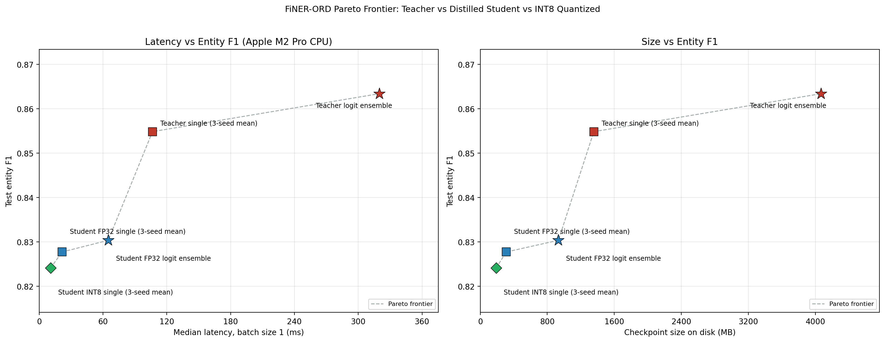

# FiNER-ORD Financial NER

This is my financial named entity recognition project for the [`gtfintechlab/finer-ord`](https://huggingface.co/datasets/gtfintechlab/finer-ord) dataset. The goal is to tag financial text with BIO labels for people, locations, and organizations:

- `O`
- `B-PER`, `I-PER`
- `B-LOC`, `I-LOC`
- `B-ORG`, `I-ORG`

The main metric is strict entity-level F1 from `seqeval`. I focused on that instead of token-level F1 because the dataset has a lot of `O` tokens, so token metrics can look better than the actual entity extraction quality.

The bigger idea for the project was: can I get a strong NER model, then make a smaller/faster version that is still pretty close in accuracy? So I ended up with a teacher model, a distilled student model, and an INT8 quantized student model.



## Quick Results

| Model | Test Entity F1 | Median Latency, bs=1 | Disk Size | What it is |
|---|---:|---:|---:|---|
| Teacher single, 3-seed mean | `0.8548` | `106.6 ms` | `1356 MB` | Best single teacher setup |
| Teacher logit ensemble | `0.8634` | `319.7 ms` | `4067 MB` | Best F1 overall |
| Student FP32 single, 3-seed mean | `0.8277` | `21.7 ms` | `311 MB` | Smaller deployable model |
| Student FP32 logit ensemble | `0.8304` | `65.0 ms` | `933 MB` | Best student F1 |
| Student INT8 single, 3-seed mean | `0.8241` | `10.8 ms` | `190 MB` | Fastest CPU model |

Main takeaways:

- The best teacher ensemble got `0.8634` strict entity F1.
- The distilled student ensemble got `0.8304` F1, which is about `96.2%` of the teacher ensemble's F1.
- The FP32 student single model is `4.9x` faster than the teacher single model at batch size 1 on my Apple M2 Pro CPU.
- The INT8 student is `9.9x` faster than the teacher single model and `2.0x` faster than the FP32 student at batch size 1.
- INT8 only dropped the student mean F1 by `0.0036`, which was comfortably inside my `0.01` tolerance.

The numbers in the chart come from `docs/figures/pareto_data.csv`, which is generated from local latency JSON artifacts. Latency was measured on an Apple M2 Pro CPU with `torch==2.3.1`, so the exact times will differ on other machines.

## What I Was Trying To Do

The project prompt was basically about winning on F1 or efficiency. I tried to do both:

1. Build a strong RoBERTa-large teacher.
2. Distill it into a smaller DistilRoBERTa student.
3. Quantize the student with dynamic INT8 for CPU inference.
4. Plot the F1/latency/size tradeoff so the result is easy to compare.

The final story is pretty simple: the teacher is the most accurate, the student is much faster and smaller, and the INT8 student is the best single-example CPU option if you can accept a tiny F1 drop.

## Dataset

FiNER-ORD is a financial NER dataset with train/validation/test splits:

| Split | Articles | Sentences | Tokens | PER | LOC | ORG |
|---|---:|---:|---:|---:|---:|---:|
| Train | 135 | 3,262 | 80,531 | 821 | 966 | 2,026 |
| Validation | 24 | 402 | 10,233 | 138 | 193 | 274 |
| Test | 42 | 1,075 | 25,957 | 284 | 300 | 544 |

The label mapping is in `src/data.py`, and I kept the dataset's original integer ordering.

## What I Built

### Teacher Model

The teacher is based on `roberta-large`. I first did domain-adaptive pretraining on the FiNER train articles, then fine-tuned a CRF token classifier. I trained three seeds and ensembled them by averaging CRF emissions before decoding.

Teacher-side pieces:

- `src/dapt.py`: FiNER-only masked language model pretraining
- `src/crf_model.py`: RoBERTa-large + CRF token classifier
- `src/evaluate.py`: strict entity F1, token F1, and per-class metrics
- `scripts/ensemble_logits.py`: vote/logit/emission ensembling

Best teacher results:

| Recipe | Test Entity F1 |
|---|---:|
| Vanilla RoBERTa-large, 3-seed mean | `0.8485 +/- 0.0022` |
| RoBERTa-large + CRF, 3-seed mean | `0.8521 +/- 0.0018` |
| Efficient RoBERTa-large + CRF, 3-seed mean | `0.8481 +/- 0.0066` |
| Efficient after FiNER DAPT, 3-seed mean | `0.8548 +/- 0.0038` |
| Efficient after FiNER DAPT, logit ensemble | `0.8634` |

I also tried a few things that did not win, including DeBERTa-v3-large, layer-wise learning rate decay, layer-wise attention scaling, and BIO repair. The RoBERTa-large + DAPT + CRF path stayed best.

### Student Model

The student is `distilroberta-base` with a normal token classification head. I intentionally did not use a CRF for the student because I wanted the inference path to stay simple and fast.

The student is trained with offline distillation. That means I saved teacher emissions once, then trained the student against those saved logits instead of running the teacher during every student training step.

Distillation loss:

```text
L_hard = CrossEntropy(student_logits, gold_labels)
L_soft = T^2 * KLDiv(
    log_softmax(student_logits / T),
    softmax(teacher_emissions / T)
)
L_total = alpha * L_hard + (1 - alpha) * L_soft
```

Student setup:

- `T = 2.0`
- `alpha = 0.5`
- Teacher signal from the 3-seed teacher ensemble
- Seeds: `88`, `5768`, `78516`
- Early stopping / best-checkpoint loading

The teacher and student both use the RoBERTa BPE family, so the saved emissions line up cleanly with the student's tokenization when using first-subword-only labels.

### INT8 Quantization

For the fastest model, I used PyTorch dynamic quantization on the student's `nn.Linear` layers:

```python
torch.quantization.quantize_dynamic(model, {torch.nn.Linear}, dtype=torch.qint8)
```

This is CPU-focused and does not need calibration data. On Apple Silicon, I had to use the `qnnpack` quantization backend because the default `fbgemm` backend is for x86.

INT8 results:

- FP32 student mean F1: `0.8277`
- INT8 student mean F1: `0.8241`
- Mean F1 drop: `0.0036`
- Size: `190 MB` instead of `311 MB`
- Batch-size-1 latency: `10.8 ms` instead of `21.7 ms`

One interesting thing: INT8 was worse than FP32 at batch size 8 on my M2 Pro (`96.3 ms` vs `56.6 ms`). So I would use INT8 for interactive/single-example CPU inference, but FP32 student for batched throughput on this hardware.

## Stack

Core ML stack:

- Python
- PyTorch `2.3.1`
- Hugging Face `transformers` `4.44.2`
- Hugging Face `datasets` `2.21.0`
- `pytorch-crf`
- `seqeval`
- scikit-learn

Experiment / analysis tools:

- YAML configs
- Weights & Biases support
- pandas / NumPy
- matplotlib
- Jupyter notebooks

Hardware for the reported latency numbers:

- Apple M2 Pro CPU
- CPU inference only for the Pareto chart
- Dynamic INT8 with `qnnpack`

## Repo Layout

```text
.
├── configs/                  # YAML experiment configs
│   └── baseline/
├── docs/
│   ├── PROJECT_CONTEXT.MD    # Longer technical notes
│   └── figures/
│       ├── pareto.png
│       └── pareto_data.csv
├── notebooks/                # Analysis notebooks
├── results/                  # Run summaries, predictions, latency outputs
├── scripts/
│   ├── build_pareto.py       # Builds the Pareto chart
│   ├── ensemble_logits.py    # Ensembles seed runs
│   ├── extract_train_emissions.py
│   ├── measure_latency.py
│   └── quantize_student.py
└── src/
    ├── data.py               # Dataset loading and label alignment
    ├── evaluate.py           # Metrics
    ├── train.py              # Training entry point
    ├── crf_model.py          # CRF teacher
    ├── dapt.py               # Domain-adaptive pretraining
    ├── distill.py            # Student distillation
    └── losses.py
```

## Setup

```bash
python -m venv .venv
source .venv/bin/activate
pip install -r requirements.txt
```

`matplotlib` is only needed if you want to regenerate the Pareto figure:

```bash
pip install matplotlib==3.9.2
```

I usually run commands with the project venv directly:

```bash
./.venv/bin/python -m src.data
```

W&B logging is optional. Distillation supports `--no-wandb`; DAPT reads W&B settings from the YAML config and continues without W&B if it is unavailable.

## Reproducing The Main Artifacts

Check that the dataset and labels load correctly:

```bash
./.venv/bin/python -m src.data
```

Run the teacher path:

```bash
./.venv/bin/python -m src.dapt --config configs/baseline/dapt_roberta_large.yaml
./.venv/bin/python -m src.train --config configs/baseline/efficient_after_dapt.yaml
```

Build the teacher ensemble:

```bash
./.venv/bin/python scripts/ensemble_logits.py \
  --runs efficient_after_dapt_seed88 efficient_after_dapt_seed5768 efficient_after_dapt_seed78516 \
  --mode logit \
  --use-crf \
  --output-name efficient_after_dapt_logit_ensemble
```

Extract teacher emissions and train the student:

```bash
./.venv/bin/python scripts/extract_train_emissions.py \
  --runs efficient_after_dapt_seed88 efficient_after_dapt_seed5768 efficient_after_dapt_seed78516

./.venv/bin/python -m src.distill \
  --config configs/baseline/student_distilled.yaml \
  --no-wandb
```

Quantize the student and measure latency:

```bash
./.venv/bin/python scripts/quantize_student.py \
  --runs student_distilled_seed88 student_distilled_seed5768 student_distilled_seed78516

./.venv/bin/python scripts/measure_latency.py \
  --runs efficient_after_dapt_seed88 student_distilled_seed88 student_distilled_seed88_int8 \
  --device cpu
```

Regenerate the Pareto chart:

```bash
./.venv/bin/python scripts/build_pareto.py
```

This writes:

- `docs/figures/pareto.png`
- `docs/figures/pareto_data.csv`

## Notes

The final teacher, student, and INT8 student are locked. For headline single-model F1, I use 3-seed means. For latency, I use seed 88 because speed mostly depends on the model architecture, not the random seed.

The main tradeoff is that INT8 is the fastest for single-example CPU inference, while the FP32 student is better for batched throughput on my Apple Silicon setup.
